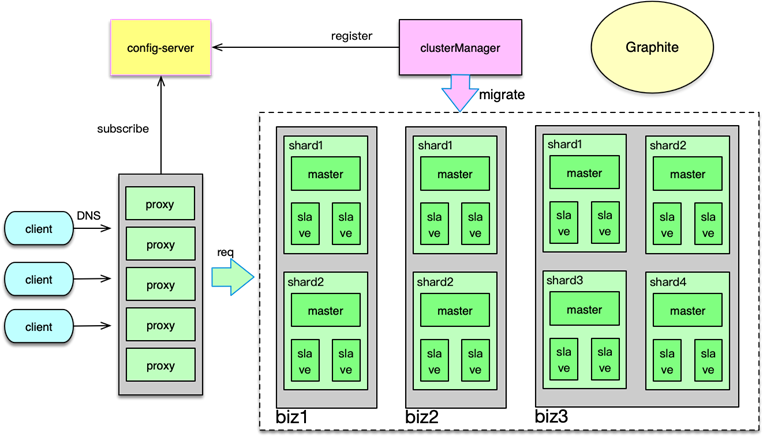

# Distributed Cached Learning

## Cache Overview
#### Feature
- one time retrieve, multi read, e.g. read from DB then save to cache, multiple read from cache
- isolated memory space for fast access
- reduce response time
#### Pons & Crons
- Pons
    + storage for high speed data exchange
        + MySQL, 3000-6000 QPS in 10 to 100ms
        + Memcached, 100,000 - 1,000,000 QPS
    + reduce application workload
    + reduce network traffic. e.g. traffic between app server and DB server
    + extendable
- Crons
    + incease application complexity. e.g. Cache only store hot data
    + increase cost
    + CAP constraits. e.g. Cache and DB is unsync
***

## Cache Category
#### Read/Write Model
- Cache Aside
    + Application maintains cache and proxy
    + Write
        + update db, delete cache
        + listener db update log to update cache
    + Read
        + hit: return from cache
        + miss: load from db, return data and store into cache
    + Lazy calculation, data based on db
    + Strong constants in cache/db
- Read/Write Through
    + Storage service maintain cache and proxy, application communicate with storage service
    + Write
        + cache does not exist then update DB
        + cache exist, update cache and DB
    + Read
        + hit: return from cache
        + miss: load from db, return data from cache
    + Merge multiple write operation into single write operation
    + Storage service isolate data read/write
- Write Behind Caching
    + Similar to Read/Write Through
    + Write
        + update cache, async update db
    + Read: same as Read/Write Through
    + Weak constants in cache/db
#### Layers
- Local Cache
    + cache within process
    + high speed
    + lose data once reboot
    + e.g. Ehache, Guava
- Local Process Cache
    + cache is independent process in local mache
    + high speed
    + resource competition between main process and cache process
- Remote Cache
    + cross machine
    + huge store
    + bandwith maybe bottle neck
    + e.g. Memached, Redis, Pika
#### Storage
- Memory cache
    + high speed
    + lose data in reboot
- Persist cache
    + reltively low speed
    + huge storage
    + e.g. SSD, Fusion-IO
***

## Cache Design Factor
#### Components
- mature product, e.g. redis, memcahced
- self development, high difficulty
#### Data Structure
- KV
- Complex data structure
- Collection
#### Distributed Cache Design
- Algorithm
    + mode, cached siting in certain cache node
    + constants hash: distribute cache in different node if some node is down
- Access
    + access by client: difficulty in application
    + access by proxy: performance downgrade due to one more layer
- Migration
    + proxy migration, e.g. Codis
    + server migration, e.g. Redis
    + no support migration, e.g memcached
#### Design Factors
- Read/Write, Big O complexity
- KV size, decouple KV if single object is too big
- Key number, store hot data
- Peak: cached in different layers
- Miss ratio
- Expire Policy
- Cache penetration loading time
- Security
***

## Cache Typical Production Issues
#### Cache invalidation
- cache expire by timer or application
- db IO increase if cache expire
- solution
    + expire time policy: base + random
    + cache does not expire at same time to reduce db IO
#### Cache penetration
- query data not in cache, request access db
- invalid data access, e.g. access key does not exist
- solution
    + record invalid key which map to special value, store invalid key in isolate cache pool
    + bloom filter
        + bit array init all bit as 0
        + hash key in k hash algo
            + write: set k in differnt bit position as 1
            + read
                + if all bit position is 1, may exist
                + if any bit position is not 1, does not exist
        + store all valid key
        + store all invalid key
#### Cache avalanche   
- cache node down cause whole cache sytem down   
- cause
    + no support rehash: cache node down, cache penetration to slow down application
    + support rehash: node crash due to overload, key store to next node, next node crash
- solution
    + flag to access db: slow query failfast
    + cache node in different server
    + monitor cache performance
#### Cache inconstant
- cache db data inconstant
- cache copies data inconstant
- solution
    + retry update cache, put cache value into mq
    + shorten cache expire
#### Data Concurrent Compitetion
- multiple request access same cache after cache expire
- solution
    + global lock to query cache data
    + multiple copy
#### Hot Key
- hot key access by huge number of request
- hot key store in one cache node, cache node over loaded
- solution
    + find hot key 
    + distributed hotkey to hotkey#1, hotkey#2
    + multiple slave or multiple cache layer
    + hotkey store in local cache
#### Big Key
- big key consume bandwidth and IO
- big key expire introduce db loading in long time
- solution
    + compress big key
    + reallocate space for big key
    + break big key into smaller key
***

## [Redis](./redis-java/README.MD)
***

## CAP
#### Factors
- Consistency
    + all nodes see the same data at same time
- Availability
    + reads and writes always successd
- Partition Tolerance
    + system continue to operate depite arbitary message loss or failure of part of the system
#### CP vs AP
- distributed system can not fulfill CA since distributed system is mutli instance
- distrubuted system may choose CP or AP in different business
- CP
    + stop the service if inconsistant between node
    + financial, payment industry
- AP
    + return different data, tolerence consistant
    + user friendly
#### CAP Extension
- BASE
    + Baiscally Available
        + core function response, lose minor function
        + system may slow down
    + Soft state
        + allow inconsistency between partition but no impact to core function
    + Eventual Consistency
        + inconsistency during error occur
        + production restore, application back to consistent
- Data Consistent
    + distribute transaction
        + check all the transaction execute, then commit transactions
        + 2 pharse commit
    + master-slave
    + message bus
        + message publish to partition
        + partition listen message from queue
***

## Distributed Cached Proposal

- proxy
    + based on business line
    + different redis node
        + base on key in different namespace
        + base on business in different port
- redis node
    + store cache but not slot
    + no store slot-key to save 20% space
- config-server
    + config reading for proxy
- clusterManager
    + SLA monitor node instance, error alter
    + mapping cache to business
        + cached to domain name
        + node instance monitor
    + register to config-server

